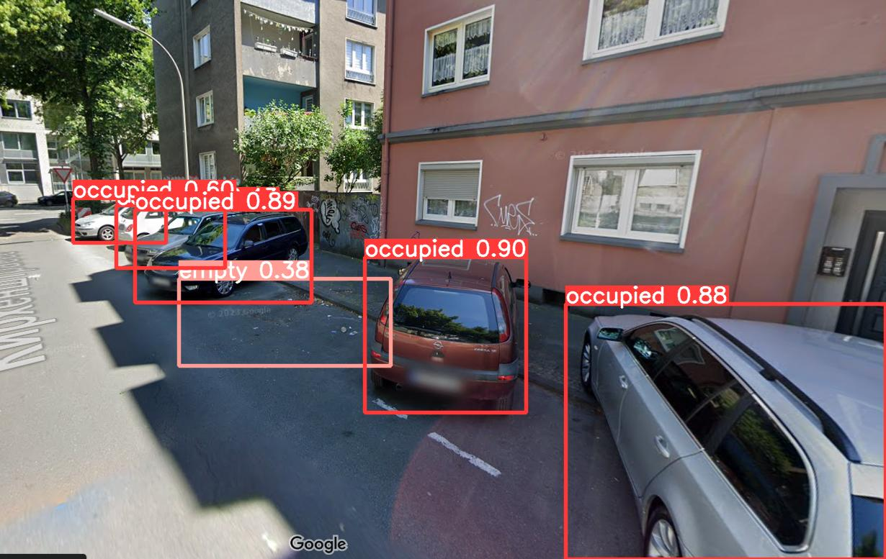

SpaceFinder AI is a Python project aimed at simplifying the process of finding free parking spaces in crowded places using artificial intelligence. The project uses YOLOv8 architecture to analyze images or video images.

## Features

- Real-time parking space detection using computer vision.
- Simple and intuitive user interface.
- Customizable settings for different parking lot layouts.
- Ability to work with various types of cameras and image/video sources.
- Efficient algorithms for fast and accurate detection.
- Integration with existing parking management systems.

## Screenshots

## Demo

Happy parking! 🚗🅿️
